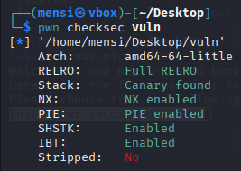

# PIE TIME 2 - Writeup

## Description


## Solution

First we will start by analysing the the binary using `file` utility.


the binary is 64 bit, dynmically linked and not stripped.



Also all the mitigations are enabled.

In this task we have the source code.

```C
#include <stdio.h>
#include <stdlib.h>
#include <signal.h>
#include <unistd.h>

void segfault_handler() {
  printf("Segfault Occurred, incorrect address.\n");
  exit(0);
}

void call_functions() {
  char buffer[64];
  printf("Enter your name:");
  fgets(buffer, 64, stdin);
  printf(buffer);

  unsigned long val;
  printf(" enter the address to jump to, ex => 0x12345: ");
  scanf("%lx", &val);

  void (*foo)(void) = (void (*)())val;
  foo();
}

int win() {
  FILE *fptr;
  char c;

  printf("You won!\n");
  // Open file
  fptr = fopen("flag.txt", "r");
  if (fptr == NULL)
  {
      printf("Cannot open file.\n");
      exit(0);
  }

  // Read contents from file
  c = fgetc(fptr);
  while (c != EOF)
  {
      printf ("%c", c);
      c = fgetc(fptr);
  }

  printf("\n");
  fclose(fptr);
}

int main() {
  signal(SIGSEGV, segfault_handler);
  setvbuf(stdout, NULL, _IONBF, 0); // _IONBF = Unbuffered

  call_functions();
  return 0;
}
```

This is a classic `Ret2win`, the program asks for an address and `jmp` to that address, so in order to solve the task we should exploit the `format string vulnerability` to get the address of the `win` function at runtime and then get our flag.


