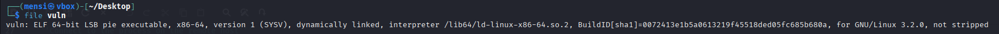

# TASK1 - Writeup

## Description


## Solution

In this task named PIE TIME we are given a binary named PIE TIME, from the name we can guess that w'll need some knowledge in position independent binaries, the first thing i did was dumping some infos from the binary using `file` utility.



We can see that its a 64bit dynamically linked binary.

After that i inspected the binary using `pwn checksec vuln`.


All the mitigations are enabled.

After reviewing the source code we can see a win function and the program print the address of main at runtime.

```c
#include <stdio.h>
#include <stdlib.h>
#include <signal.h>
#include <unistd.h>

void segfault_handler() {
  printf("Segfault Occurred, incorrect address.\n");
  exit(0);
}

int win() {
  FILE *fptr;
  char c;

  printf("You won!\n");
  // Open file
  fptr = fopen("flag.txt", "r");
  if (fptr == NULL)
  {
      printf("Cannot open file.\n");
      exit(0);
  }

  // Read contents from file
  c = fgetc(fptr);
  while (c != EOF)
  {
      printf ("%c", c);
      c = fgetc(fptr);
  }

  printf("\n");
  fclose(fptr);
}

int main() {
  signal(SIGSEGV, segfault_handler);
  setvbuf(stdout, NULL, _IONBF, 0); // _IONBF = Unbuffered

  printf("Address of main: %p\n", &main);

  unsigned long val;
  printf("Enter the address to jump to, ex => 0x12345: ");
  scanf("%lx", &val);
  printf("Your input: %lx\n", val);

  void (*foo)(void) = (void (*)())val;
  foo();
}
```
